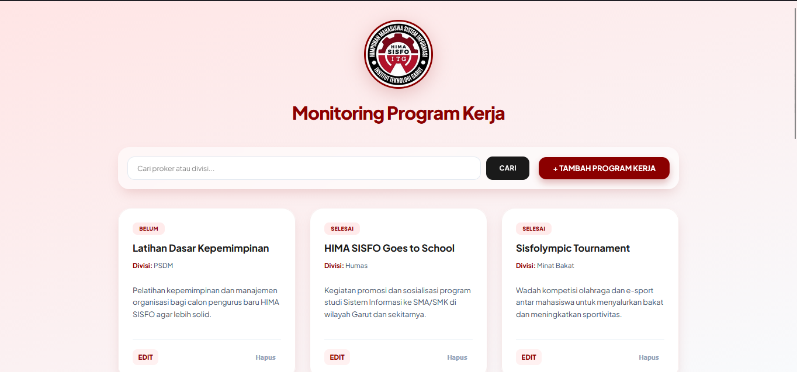
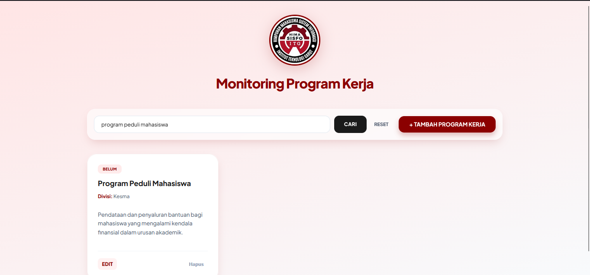
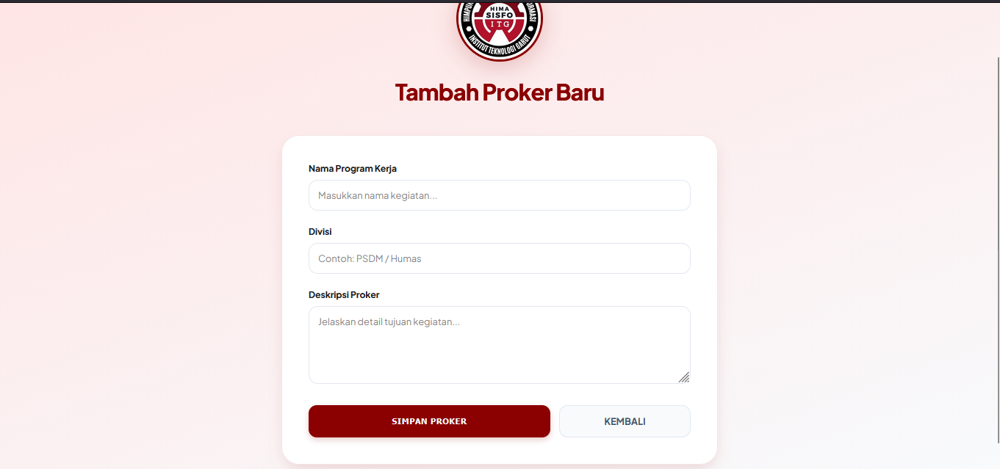
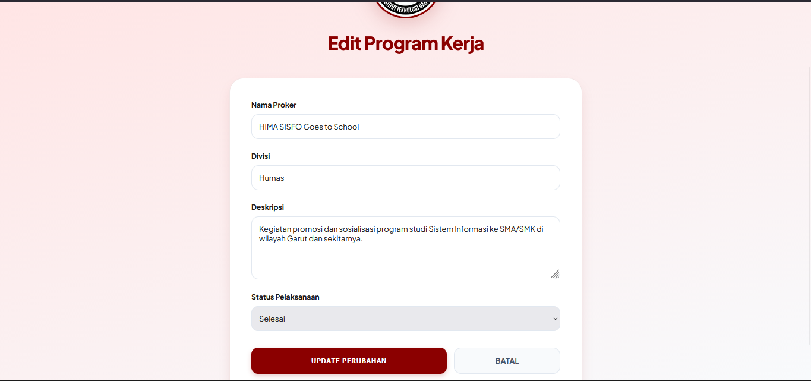

# SI-PROKER HIMA (Sistem Monitoring Program Kerja)

Aplikasi berbasis web ini dirancang untuk mempermudah manajemen serta pengawasan program kerja di lingkungan **Himpunan Mahasiswa Sistem Informasi Institut Teknologi Garut**.

## Fitur Utama
Aplikasi ini sudah dilengkapi dengan fitur-fitur esensial untuk manajemen proyek:
* **Dashboard Monitoring**: Tampilan modern berbasis kartu (*card*) untuk melihat seluruh daftar proker secara ringkas.
* **Sistem CRUD Lengkap**: Kemampuan untuk Menambah, Melihat, Mengubah, dan Menghapus data program kerja.
* **Fitur Pencarian Dinamis**: Memudahkan pencarian proker berdasarkan nama kegiatan atau divisi secara *real-time*.
* **Manajemen Status**: Pelacakan progres kegiatan dengan status 'Belum', 'Sedang', dan 'Selesai'.
* **Validasi Data**: Keamanan input data untuk memastikan setiap informasi yang masuk sesuai dengan kriteria.

##  Dokumentasi Sistem

### 1. Halaman Utama (Dashboard)
Menampilkan seluruh program kerja dalam bentuk grid kartu yang rapi dan modern.

### 2. Fitur Pencarian (Search)
Memungkinkan pengguna memfilter data secara cepat berdasarkan judul proker atau divisi.

### 3. Tambah Program Kerja
Formulir input untuk mendaftarkan kegiatan baru ke dalam sistem database.

### 4. Edit Program Kerja
Halaman untuk memperbarui detail informasi atau mengubah status progres kegiatan.

##  Teknologi 
* **Framework:** Laravel 10/11
* **Database:** MySQL
* **Version Control:** GitHub

##  Daftar Anggota Kelompok
| Nama | NIM | 
| :--- | :--- | 
| **Rafly Fahlevi Herdiana** | 2307018 | 
| **Rafi Miftahul Fauzi** | 2307024 | 
| **Reyhan Muhammad Fathir** | 2307001 |